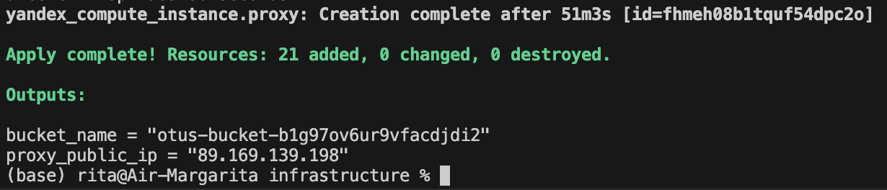
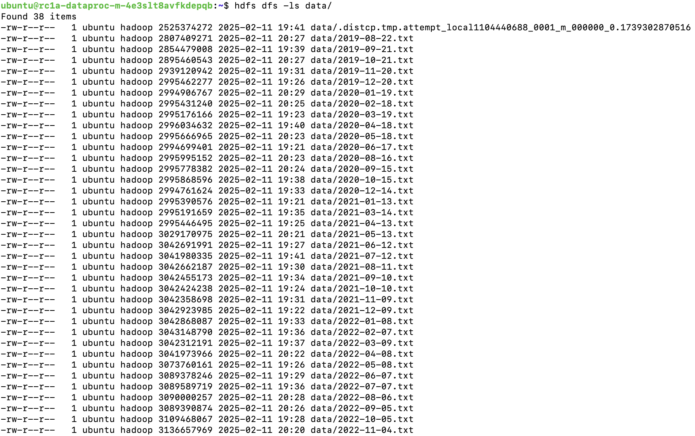

### Результаты задания

Выходные логи после запуска terraform скрипта:

Ссылка на собственный (общедоступный) S3 бакет: https://otus-bucket-b1g97ov6ur9vfacdjdi2.website.yandexcloud.net (s3://otus-bucket-b1g97ov6ur9vfacdjdi2/)

Содержимое HDFS-директории, куда были перекнуты объекты с собственного бакета:

