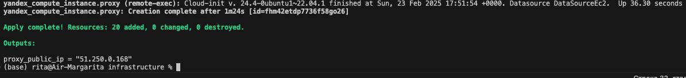

### Результаты задания

Выходные логи после запуска terraform скрипта:


Ссылка на собственный (общедоступный) S3 бакет: https://otus-bucket-b1g97ov6ur9vfacdjdi2.website.yandexcloud.net (s3://otus-bucket-b1g97ov6ur9vfacdjdi2/)

В HDFS данные были скопированы напрямую из публичного бакета путем выполнения:

`hadoop distcp s3a://otus-mlops-source-data/ /user/ubuntu/data`

Скрипт по обработке данных лежит в гите по пути  `scripts/prepare_data.py`

В собственном бакете для примера представлены 2 паркета, полученных путем прогона соответствующих исходных txt-файлов через скрипт по обработке. 

Паркеты переброшены в S3 через команды:

`hadoop distcp clear_data/2020-05-18.txt.parquet s3a://otus-bucket-b1g97ov6ur9vfacdjdi2/`

`hadoop distcp clear_data/2022-08-06.txt.parquet s3a://otus-bucket-b1g97ov6ur9vfacdjdi2/`

Пример вызова скрипта через ноутбук:

```python
import findspark
findspark.init()

import pyspark
from prepare_data import DataPreparing

app_name = "rita_spark_session"
spark = (
    pyspark.sql.SparkSession
        .builder
        .appName(app_name)
        .config("spark.executor.memory", "1g")
        .config("spark.driver.memory", "1g")
        .getOrCreate()
)
spark.conf.set('spark.sql.repl.eagerEval.enabled', True)

data_manager = DataPreparing(spark, path="data/2020-05-18.txt")
data_manager.run()
```