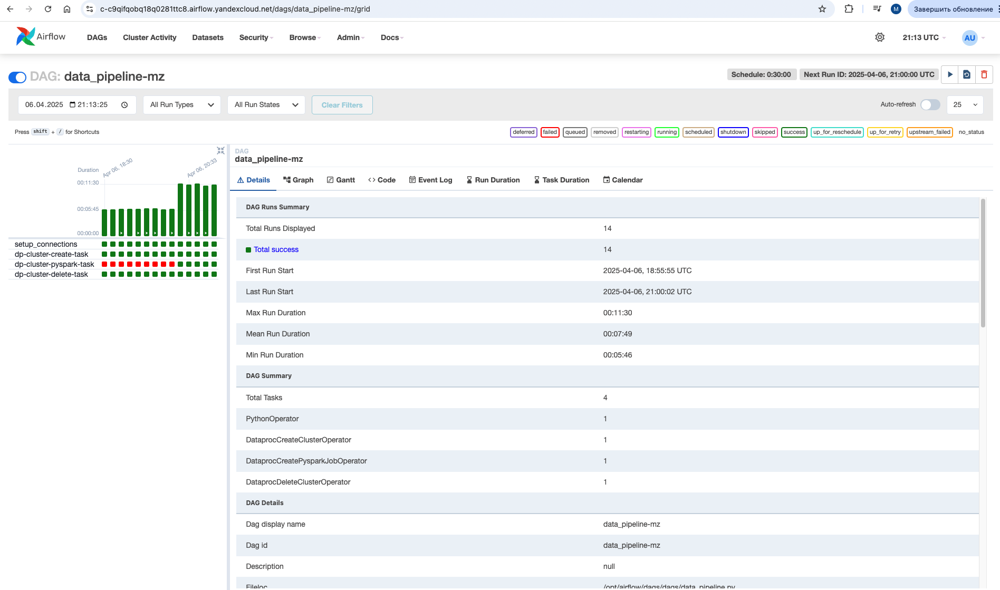
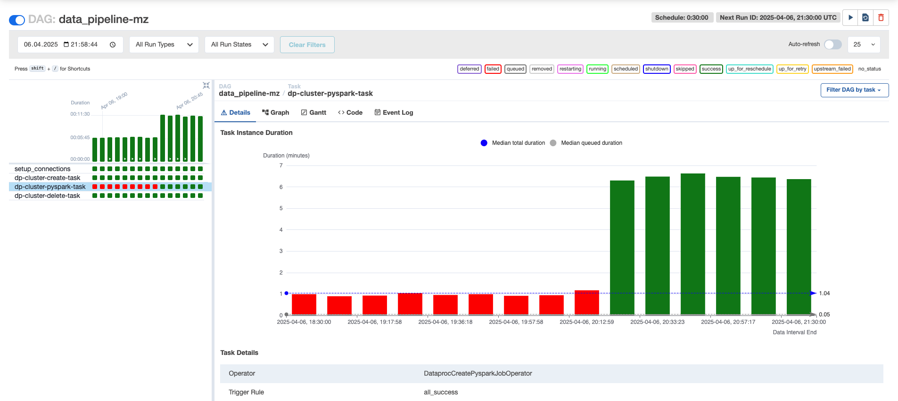
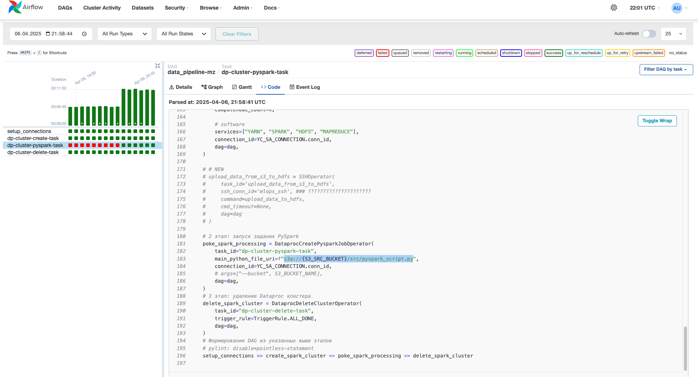

### Результаты задания

Запуски DAG'ов в Airflow (неуспешные и успешные):

Запуски джобы по выполнению скрипта по очистке данных:

Кусочек с кодом:

**Алгоритм действий:**
1. Поднимаем Airflow кластер через terraform
2. Файл с переменными (variables.json) закидываем в Airflow через UI
3. Закидываем скрипты из папок `dags/` и `src/` через `s3cmd` в бакет, созданный в процессе исполнения terraform (например, `s3cmd put --recursive src/ s3://airflow-bucket-c1b4413a41d03843/src/`)
4. Включаем DAG
